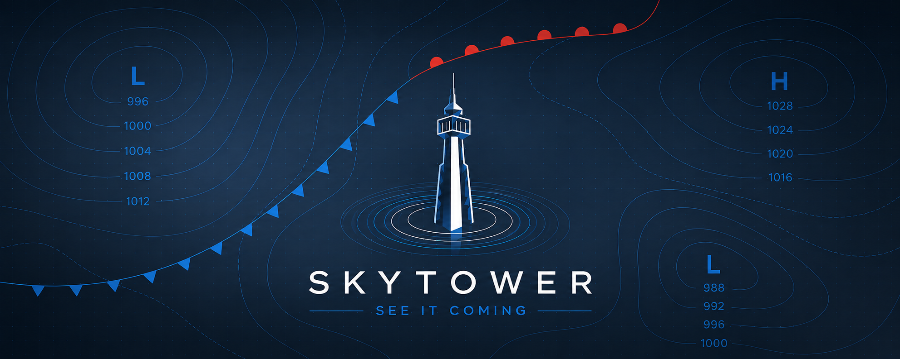

  

# SkyTower Weather

**SkyTower doesn't just tell you about the weather. It helps you understand it.**

Most weather apps stop at the temperature and one condition. SkyTower surfaces what's happening, what's changing, and what's coming — so you're never caught off guard, and never left wondering why the forecast didn't hold. Weather is hard to predict. SkyTower won't pretend otherwise; it'll help you read it.

Weather literacy is a core experience of SkyTower, not just a separate educational feature bolted onto the app, using SkyTower should naturally teach people how to think about weather. The better SkyTower does its job, the less dependent people become on blindly following an app.

SkyTower gives you the weather intelligence that helps you see it coming.